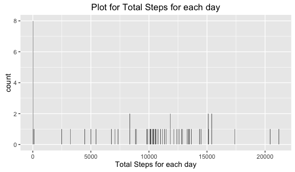

# Reproducible Research: Peer Assessment 1


```r
knitr::opts_chunk$set(echo = TRUE)
```

## Loading and preprocessing the data

```r
data1 <- read.csv("activity.csv")
```

## What is mean total number of steps taken per day?

```r
library(ggplot2)
totalSteps <- tapply(data1$steps, data1$date, FUN=sum, na.rm=TRUE)  ##Calculate the total steps by date.
```


```r
qplot(totalSteps, binwidth=30,xlab = "Total Steps for each day",main = "Plot for Total Steps for each day")
```

<!-- -->


```r
mean(totalSteps,na.rm=TRUE)
```

```
## [1] 9354.23
```

```r
median(totalSteps, na.rm = TRUE)
```

```
## [1] 10395
```

## What is the average daily activity pattern?


## Imputing missing values


## Are there differences in activity patterns between weekdays and weekends?
