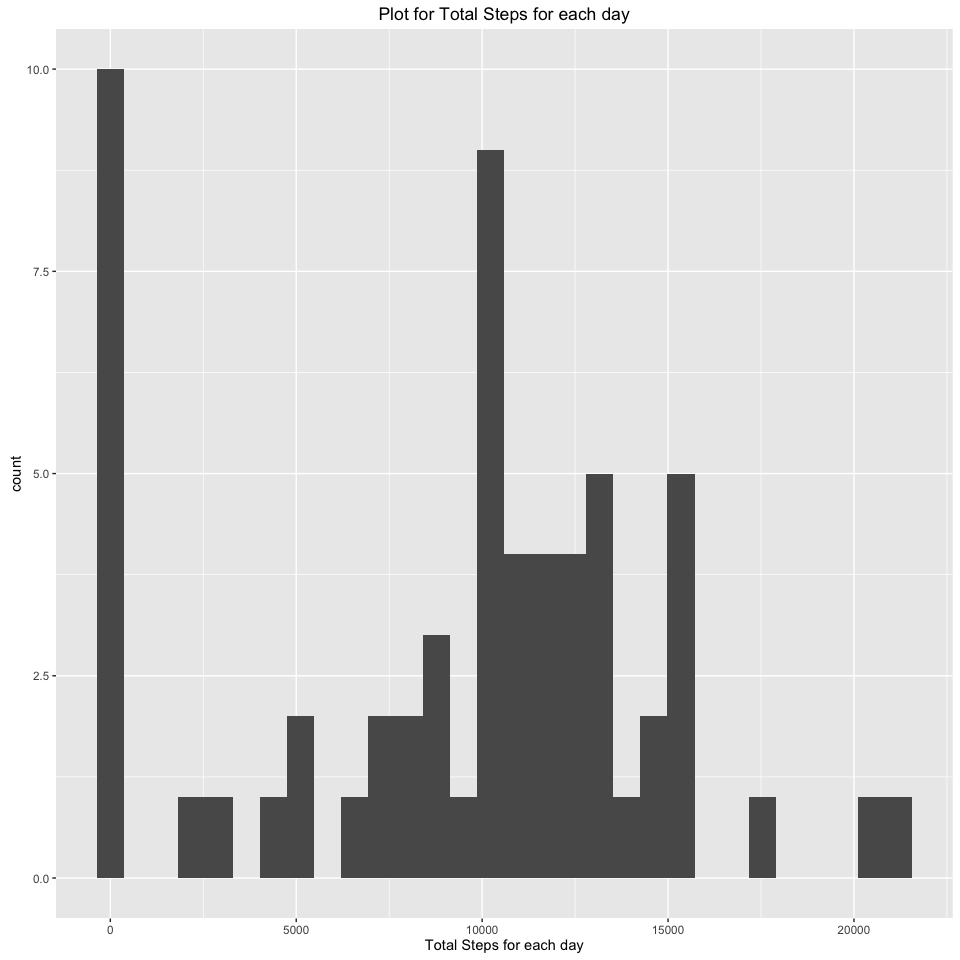

# Reproducible Research: Peer Assessment 1


```r
knitr::opts_chunk$set(echo = TRUE)
```

## Loading and preprocessing the data

```r
data1 <- read.csv("activity.csv")
```

## What is mean total number of steps taken per day?

```r
library(ggplot2)
totalSteps <- tapply(data1$steps, data1$date, FUN=sum, na.rm=TRUE)  ##Calculate the total steps by date.
qplot(totalSteps,xlab = "Total Steps for each day",main = "Plot for Total Steps for each day")
```

```
## `stat_bin()` using `bins = 30`. Pick better value with `binwidth`.
```

<!-- -->


```r
mean(totalSteps,na.rm=TRUE)
```

```
## [1] 9354.23
```

```r
median(totalSteps, na.rm = TRUE)
```

```
## [1] 10395
```

## What is the average daily activity pattern?

```r
library(ggplot2)
library(plyr)
averageStep <- ddply(data1, c("interval"), summarise, mean = mean(steps,na.rm = TRUE))
colnames(averageStep)[2]<-"meanStep" ##Rename the Steps column
ggplot(data=averageStep, aes(x=interval, y=meanStep)) + 
        geom_line() +
        xlab("5-minute interval") +
        ylab("average number of steps taken")
```

<!-- -->

```r
## What is maximum number of steps?
averageStep[which.max(averageStep$meanStep),] ##Finding the max value of Steps
```

```
##     interval meanStep
## 104      835 206.1698
```

## Imputing missing values


## Are there differences in activity patterns between weekdays and weekends?
